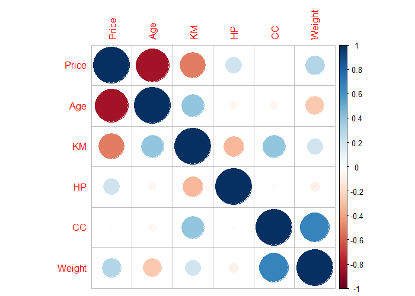

# R_CS_03
Traditional Regression problem project in R

### Case-Study Title: Simple Linear Regression Analysis
### Data Analysis methodology: CRISP-DM
### Dataset: Toyota Used Cars certified features and dealing (sold) prices in Europe
### Case Goal: Price Recommendation Intelligence System for Toyota Used Cars in Europe Trading Platform

Correlation plot between Price and other continuous predictor variables

Scatter plot between Price and other continuous predictor variables

Estimated Linear Regression line and Quadratic Regression line between Price and KM

Actuals versus Predictions plot (final model performance evaulation in Test dataset)

